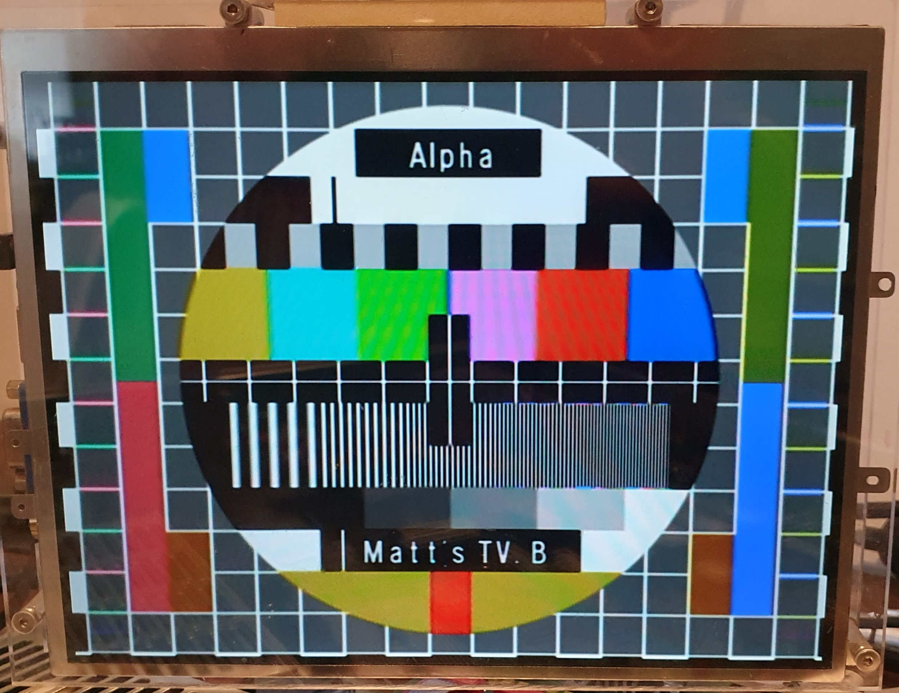
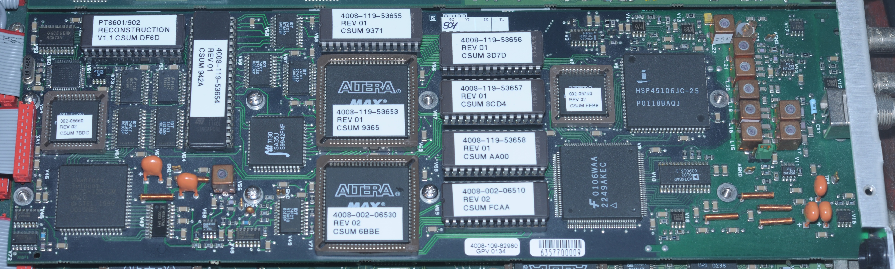

# PT8601/902 Reconstruction

This folder contains a functionally accurate reconstruction of option 902 for the PT8601 Analogue Signal Generator which adds the 4:3 PHILIPS circle pattern to the standard set. As per the original implementation of PT8601/902 the in-pattern time/date functionality is not available and cannot be added due to insufficient MCU memory. If this functionality is required it is recommended to convert the PT8601 to a PT8631 however note this is considerably more difficult.

The original MCU code is lost to history, and probably only worked on very early PT8601 boards which differ to those in general circulation in unknown ways.

In addition to re-programming most of the chips on the board, the MCU (V50) must be changed to DS80C320ECL.

It must be installed in a PT5210 running the "DVG" firmware in this repository.

